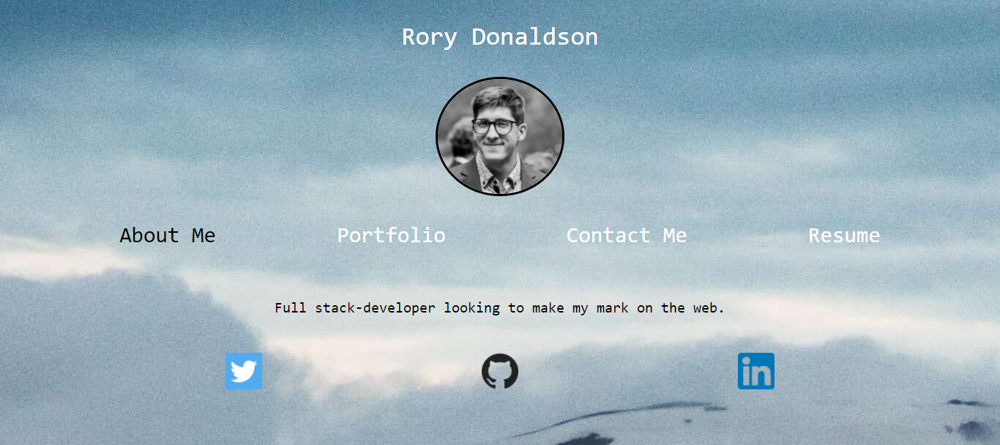

# Portfolio_4.0

## About

A remake of the previous portfolio, built with React this time. There's an About Me section, a contact info section (complete with input form for user submissions), a resume section and a portfolio section showcasing all my projects.

## Screenshots

Screenshot #1:

## Links

- Live deploy of main on GitHub Pages:

## Technology Used

- React-hook-form
- React-router-dom
- Create-react-app
- CSS

## References

Background photo by [Norris Niman](https://unsplash.com/@norrisniman?utm_source=unsplash&utm_medium=referral&utm_content=creditCopyText") on [Unsplash](https://unsplash.com/s/photos/minimalist-fractal?utm_source=unsplash&utm_medium=referral&utm_content=creditCopyText)

Icons made by <https://www.freepik.com> from <https://www.flaticon.com/>